# CS180 Project 5: Neural Radiance Field!

## Part 1: Fit a Neural Field to a 2D Image

### Method

#### Architecture

The model of my 2D neural field is a simple MLP with 4 hidden layer. The input dimension is $2\times(2\textbf L + 1)$ where $\textbf L$ is the level of positional encoding. The activation function between layers is `ReLU`. The output dimension is 3, representing the RGB value of the pixel. At the end of the MLP, I added a `Sigmoid` layer to constrain the network output be in the range of (0, 1).

In my implementation, I set the hidden dimension to be 256 and the number of layers to be 4. The learning rate is set to be 0.001. The batch size is set to be 16384. The number of epochs is set to be 300.

The positional encoding is a simple sine and cosine function. The input $x$ is first scaled to the range of (0, 1). Then, the positional encoding is defined as:

$$
P E(x)=\left\{x, \sin \left(2^0 \pi x\right), \cos \left(2^0 \pi x\right), \sin \left(2^1 \pi x\right), \cos \left(2^1 \pi x\right), \ldots, \sin \left(2^{L-1} \pi x\right), \cos \left(2^{L-1} \pi x\right)\right\}
$$

In my implementation, I set $L=10$.

#### Hyperparameters Tuning

I varied the level of PE and learning rate to find the best hyperparameters with the best PSNR.

First, I fixed the learning rate to be 0.01 and hidden dimension to be 256. Then, I trained the model with different level of PE: 6, 8, 10, 12, 14. The result is shown below:

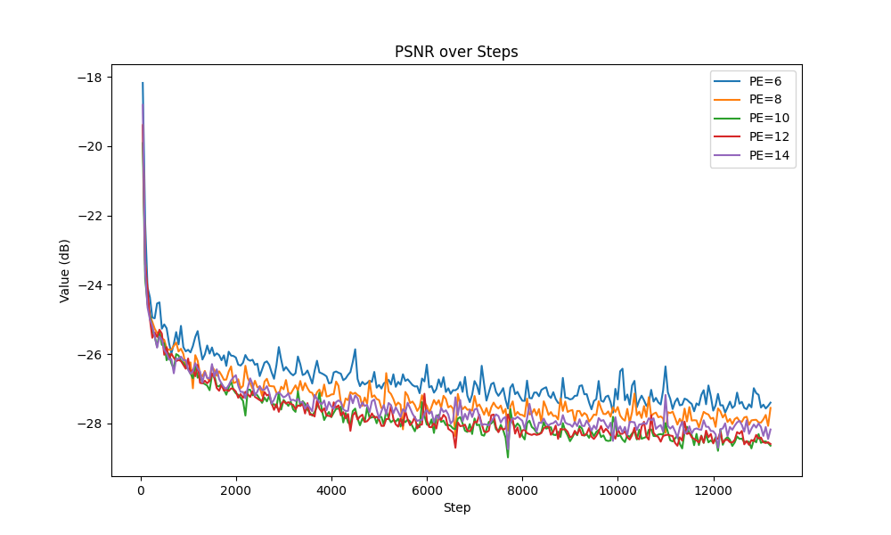

From the figure, we can see that the PSNR decreases(get better) as the level increases before it reaches 10. After that, the PSNR does not change much. Therefore, I set the level of PE to be 10.

This makes sense because the input image is 1024x689. $2^{10}=1024$. Therefore, the input image can be encoded by the PE with level 10. When $L \leq 10$ the resolution of positional encoding is not enough to encode the position. When $L > 10$, $\forall i > 10, \sin \left(2^{i} \pi x\right)$ is redundant because it is the same as $\sin \left(2^{i-10} \pi x\right)$. Therefore, the PSNR does not change much.

Then, I fixed the level of PE to be 10 and hidden dimension to be 256. Then, I trained the model with different learning rate: 1e-1, 5e-2, 1e-2, 1e-3, 1e-4, 1e-5. The result is shown below:

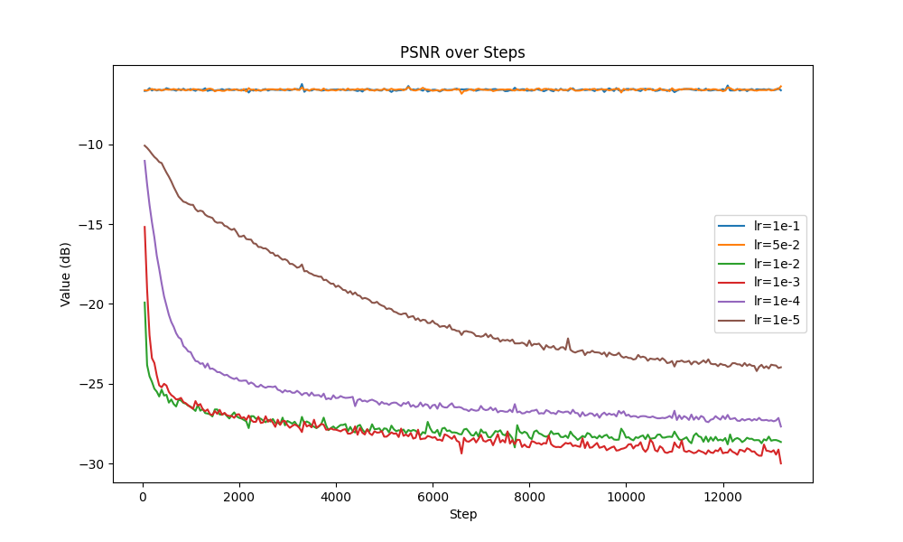

From the figure, we can see that when lr=1e-1 and 5e-2, the model cannot converge. When lr=1e-3, the model gets the best PSNR. When lr=1e-4 and 1e-5, the model converges but it takes more steps to reach the same PSNR as lr=1e-3. Therefore, I set the learning rate to be 1e-3.

#### Training PSNR

With the best hyperparameters given above, I trained the model for 300 epochs. The result is shown below:

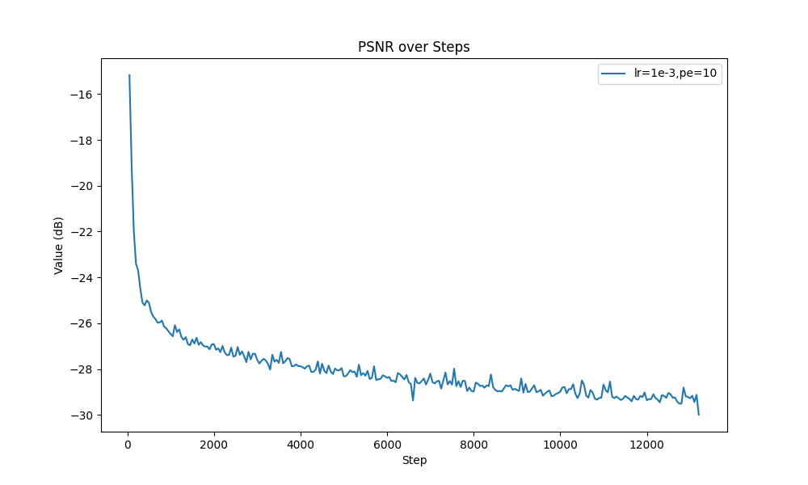

### Training Process Visualization

    <figure>
        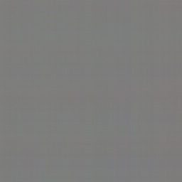
        <figcaption>Epoch 0</figcaption>
    </figure>
    <figure>
        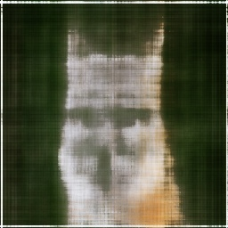
        <figcaption>Epoch 1</figcaption>
    </figure>
    <figure>
        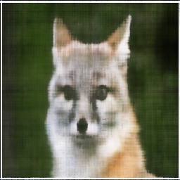
        <figcaption>Epoch 2</figcaption>
    </figure>
    <figure>
        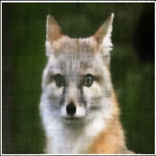
        <figcaption>Epoch 3</figcaption>
    </figure>
    <figure>
        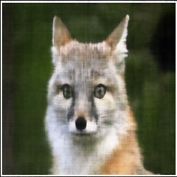
        <figcaption>Epoch 4</figcaption>
    </figure>
    <figure>
        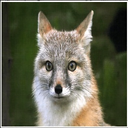
        <figcaption>Epoch 299</figcaption>
    </figure>
    

### Another Image Result

    <figure>
        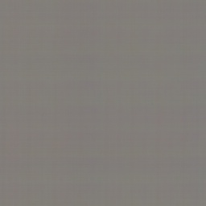
        <figcaption>Epoch 0</figcaption>
    </figure>
    <figure>
        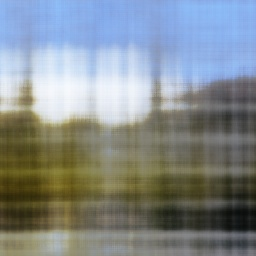
        <figcaption>Epoch 1</figcaption>
    </figure>
    <figure>
        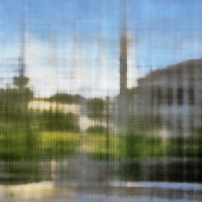
        <figcaption>Epoch 2</figcaption>
    </figure>
    <figure>
        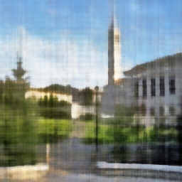
        <figcaption>Epoch 3</figcaption>
    </figure>
    <figure>
        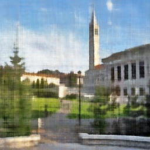
        <figcaption>Epoch 4</figcaption>
    </figure>
    <figure>
        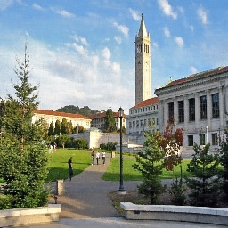
        <figcaption>Epoch 299</figcaption>
    </figure>
    

The PSNR of the training process is shown below:

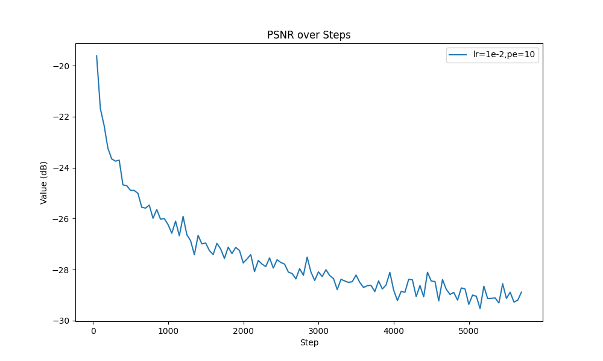

## Part 2: Fit a Neural Radiance Field from Multi-view Images

### Method

#### Create Rays from Cameras

Given $\textbf{focal}=f$ and $\textbf{c2w}=E$, we can create rays from cameras. First, the origin of the ray is the camera center $o = t$. To get the direction of the ray, we need to transform the pixel coordinate to the world coordinate. The pixel coordinate is defined as:

$$
\textbf{p} = \left[\begin{array}{c}u \\ v\end{array}\right]
$$

where $u, v$ are the pixel coordinate. The intrinsic matrix is defined as:

$$
\textbf{K} = \left[\begin{array}{ccc}f & 0 & o_x \\ 0 & f & o_y \\ 0 & 0 & 1\end{array}\right]
$$

where $o_x, o_y$ are the center of the image. With the intrinsic matrix, we can transform the pixel coordinate to the camera coordinate:

$$
\textbf{p}_{\text{camera}} = \textbf{K}^{-1}\textbf{p} = \left[\begin{array}{c}u \\ v \\ 1\end{array}\right]
$$

Then, we can transform the pixel coordinate from the camera coordinate to the world coordinate:

$$
\textbf{p}_{\text{world}} = E \textbf{P}_{\text{camera}}
$$

Therefore, the direction of the ray is:

$$
\textbf{d} = \frac{\textbf{p}_{\text{world}} - o}{\left\|\textbf{p}_{\text{world}} - o\right\|}
$$

#### Sampling

Given the ray, we can sample the point on the ray. Since the direction of the ray is normalized, we can sample the point on the ray by:

$$
\textbf{p}_i = o + t \cdot \textbf{d}, t \in [near, far]
$$

To introduce randomness, we can sample the point on the ray by:

$$
\textbf{p}_i = o + (t + \epsilon) \cdot \textbf{d}, t \in [near, far]
$$

where $\epsilon \sim \mathcal{U}(-\frac{far - near}{N}, \frac{far - near}{N})$.

In my implementation, I set $N=64$.

#### Model Architecture

Given a point on the ray and the direction of the ray, the model should predict the RGB value of the point as well as the density of the point. Similar to the 2D model, I use a MLP to predict the RGB value and density. The input dimension is $3\times(2\textbf L + 1)$ where $\textbf L$ is the level of positional encoding. The activation function between layers is `ReLU`. After 4 256-dimension hidden layers, the output then feeds into 2 different MLPs. The output dimension of the RGB MLP is 3. The output dimension of the density MLP is 1. At the end of the RGB MLP, I added a `Sigmoid` layer to constrain the network output be in the range of (0, 1). At the end of the density MLP, I added a `ReLU` layer to constrain the network output be positive.

In my implementation, I set the hidden dimension to be 256 and the number of layers to be 4. The learning rate is set to be 5e-4. The batch size is set to be 1024 (rays).

#### Volume Rendering

Given the RGB value and density of the point, we can render the image by:

$$
\textbf{C} = \sum_{i=1}^{N} w_i \cdot \textbf{C}_i
$$

where $\textbf{C}_i$ is the RGB value of the $i$-th point on the ray. $w_i$ is the weight of the $i$-th point on the ray. The weight is defined as:

$$
w_i = (1 - \exp(-\alpha_i \Delta t_i)) \exp(\sum_{j=1}^{i-1}-\alpha_j \Delta t)
$$

where $\alpha_i$ is the density of the $i$-th point on the ray, $\Delta t_i$ is the distance between the $i$-th point and the $(i-1)$-th point on the ray.

### Result

#### Rays and Samples

The rays and samples are shown below:

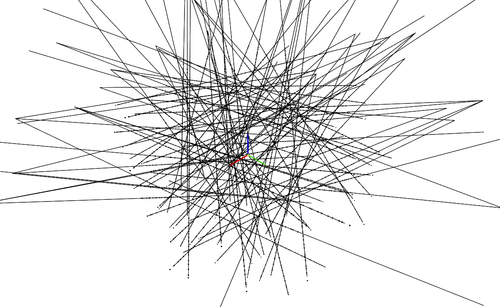

The rays are randomly sampled from all pixels of all images. The number of rays in the figure is 100. Each ray has 64 samples.

#### Training Process

    <figure>
        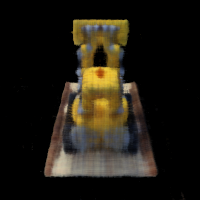
        <figcaption>Epoch 1</figcaption>
    </figure>
    <figure>
        
        <figcaption>Epoch 1</figcaption>
    </figure>
    <figure>
        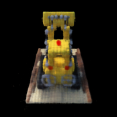
        <figcaption>Epoch 3</figcaption>
    </figure>
    <figure>
        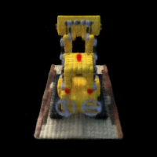
        <figcaption>Epoch 4</figcaption>
    </figure>
    <figure>
        
        <figcaption>Epoch 5</figcaption>
    </figure>
    <figure>
        
        <figcaption>Epoch 80</figcaption>
    </figure>
    

#### PSNR Curve

The PSNR curve is shown below:

#### Spherical Animation

    <figure>
        
        <figcaption>Epoch 1</figcaption>
    </figure>
    <figure>
        
        <figcaption>Epoch 85</figcaption>
    </figure>
    

### Bells and Whistles

#### Coarse-to-fine Sampling

To improve the performance and effeciency of sampling, I use coarse-to-fine sampling as described in the paper. The idea is to sample the point on the ray with a coarse step first. Then, we can sample the point on the ray based on $w_i$ along the ray with a fine step.

To speed up the training process, I use a pre-trained coarse model to generate the coarse samples. Then, with a pre-trained weight, I can sample the point on the ray with a fine step.

    <figure>
        
        <figcaption>w/o Coarse-to-Fine</figcaption>
    </figure>
    <figure>
        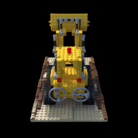
        <figcaption>w/ Corase-to-Fine</figcaption>
    </figure>
    

#### Better PSNR

With the coarse-to-fine sampling, I can get a better PSNR. The PSNR curve is shown below:

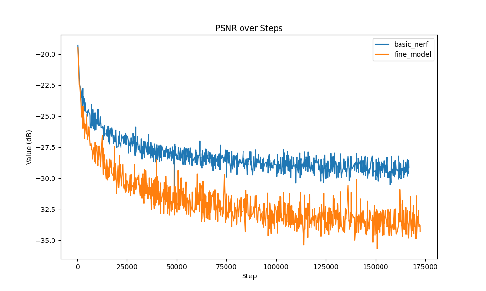

As shown in the figure, the PSNR of the coarse-to-fine model converges faster than the model without coarse-to-fine sampling. Its PSNR gets better than the model without coarse-to-fine sampling and reached 32.5 dB.

#### White Background

To change the background color of the image, I add a sample in white color at the end of the ray. So if the ray does not hit any object, the color of the ray will be white.

    <figure>
        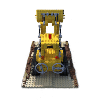
        <figcaption>White Background</figcaption>
    </figure>
    

#### Depth Map Video

To get the depth map from NeRF, I integrate $w_i$ along the ray. The depth map video is shown below:

    <figure>
        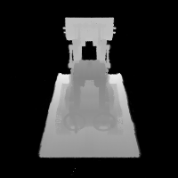
        <figcaption>Depth Map</figcaption>
    </figure>
    

